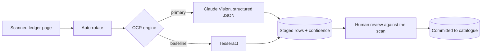
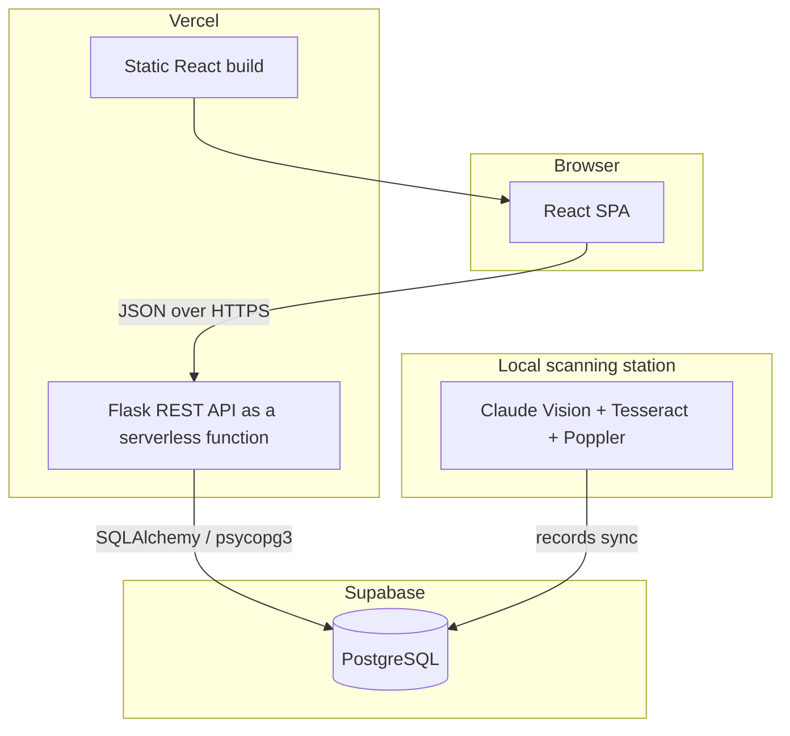

# ePustaka Munshi

A web-based library management system for a Malaysian secondary school (SMK Abdullah Munshi). It replaces the school's handwritten paper ledger with a searchable digital catalogue, and uses a vision language model to read the old handwritten records that normal OCR couldn't handle.

**Live demo:** https://epustaka-munshi.vercel.app

Built as my Final Year Project for the B.Sc. (Hons) Software Engineering programme at Universiti Teknologi Malaysia (UTM), in collaboration with the school librarian.

<!-- Screenshots go here (login, dashboard, OCR review, circulation). -->

## The problem

For years the school library recorded every book it acquired by hand, in a physical register called the *Daftar Buku-Buku Perpustakaan*. Borrowing and returning were tracked on paper too.

That created a few problems that kept getting worse over time:

- You can't search a paper ledger. Checking whether the library owns a title, or how many copies exist, means flipping through pages.
- Years of acquisition data (titles, authors, prices, sources) sit in a book that no system can query or report on.
- Paper is fragile. Fading ink, water damage or a lost page can wipe out the only record of a book.
- Manual transcription is slow and inconsistent, so the same class or name ends up spelled several different ways.
- Staff have no easy view of active loans, overdue books or borrowing trends.

The hard part isn't building a database. It's that the ledger is full of decades-old cursive handwriting that off-the-shelf OCR engines can't read accurately.

So the question the project tries to answer is: how do you turn a fragile, unsearchable, handwritten library ledger into a reliable digital system that a school can actually use day to day?

## Objectives

1. To analyze and design a library management system that addresses issues in manual record-keeping, book cataloguing, and borrowing activities.
2. To develop a web-based library management system integrated with OCR to digitize handwritten ledger records into a centralized database, and to implement barcode-based borrowing and returning with role-based access for librarians and library prefects.
3. To evaluate the system's functionality, accuracy, and usability through testing and feedback from library staff and students.

## Scope

- Modules for book management, student records, borrowing and returning transactions, and OCR digitization.
- Runs in a normal web browser, deployed on Vercel, with Supabase (PostgreSQL) as the backend and React for the interface, so it works on existing school computers with nothing to install.
- OCR is used specifically to digitize the existing handwritten ledger records into the catalogue.

## Features

| Module | What it does |
|---|---|
| Catalogue and inventory | Books with multiple physical copies, each tracked by accession number, barcode, status, condition and shelf location. Barcode label printing included. |
| Circulation | Barcode checkout and return with two-step verification, 7-day loans with one renewal, date-based overdue tracking, and loan history showing which staff handled it. |
| Members and roles | Borrowers (Student, Staff, External) and operators (Administrator, Librarian, Library Prefect). A student can be promoted to Library Prefect and demoted back, keeping their student portal. |
| Ledger OCR | Upload a scanned ledger page, the vision model extracts structured fields with a confidence score per row, staff verify each row against the source scan, then commit it to the catalogue. Over 2,700 rows were extracted from a 139-page ledger. |
| NILAM leaderboard | Tracks the Malaysian NILAM reading programme (top students, classes and forms by books read). |
| Student import | Imports class rosters straight from the school's Excel files (one sheet per class), parsed in memory. |
| Bilingual UI | Full English and Bahasa Melayu interface (i18next). |

## How the OCR works

This is the main idea of the project. I tested traditional OCR (Tesseract) first, and it could not read the old cursive handwriting reliably. So the system uses Anthropic's Claude vision model as the primary OCR engine, and keeps Tesseract as a baseline for comparison and for detecting page orientation.

A vision model works better here for a few reasons:

- It handles cursive, smudged and rotated handwriting much better than classical OCR.
- Using tool-calling, it returns structured JSON with each ledger column mapped to a typed field, instead of a block of text that would need fragile regex parsing.
- It gives a confidence score per row, so low-confidence extractions get flagged for review.



The AI never writes to the catalogue on its own. Extracted rows are staged, and a librarian checks each one against the original scan before committing. Accuracy where it matters, speed where it doesn't.

OCR processing runs on a local machine because it needs the native imaging libraries and the API key. The verified records then sync to Supabase, which the deployed web app serves to the whole school. The heavy work stays local, and the review-and-commit step works from anywhere.

## Architecture

Three tiers, deployed as a single Vercel project that serves both the React app and the Flask API.



Role-based access is enforced in the Flask API, not in the client. Overdue status is worked out by date (`due_date < now`) rather than stored as a flag, so it's always correct without a scheduled job.

## Tech stack

| Layer | Tools |
|---|---|
| Frontend | React 19, TypeScript, Vite, TanStack Query, React Router, i18next, Bootstrap 5 |
| Backend | Flask 3, SQLAlchemy 2, Flask-Login, Flask-CORS |
| Database | Supabase (PostgreSQL) via psycopg 3, SQLite for local dev |
| AI / OCR | Anthropic Claude Vision (configurable model), Tesseract + Poppler baseline |
| Other | python-barcode, openpyxl (Excel import), pdf2image |
| Deployment | Vercel (static SPA plus Python serverless function) |

## The ledger format

The OCR maps each row of the physical *Daftar Bahan Bacaan* to a structured record, keeping the original Malaysian library fields:

| Field (BM) | Meaning |
|---|---|
| No. Perolehan | Accession / acquisition number |
| No. Panggilan | Call number |
| Pengarang | Author |
| Tajuk Buku | Book title |
| Penerbit | Publisher |
| Tarikh Penerbit | Publication year |
| Tarikh Perolehan | Acquisition date |
| Bil. No. | Bill number |
| Punca | Source / origin |
| Harga | Price (RM) |
| Muka Surat | Page count |
| Catatan | Notes |

Committed rows are archived in a `digitized_ledger` table for traceability back to the original scan, then linked to catalogue `Book` and `BookCopy` entries with standardized accession numbers and barcodes.

## Roles

| Role | Access |
|---|---|
| Administrator | Everything: users, catalogue, circulation, OCR, settings. |
| Librarian | Catalogue, circulation, OCR, member management. |
| Library Prefect | A promoted student: catalogue and circulation tools plus their normal student portal. |
| Student | Search the catalogue, view their own loans and overdue status, track NILAM progress. |

## Some implementation notes

A few decisions that came out of real constraints while building it:

- The vision model returns typed JSON per column through tool-calling, so there's no fragile text parsing and the schema stays consistent.
- The 139-page ledger is processed page by page with a commit after each page, so an interrupted run resumes where it stopped instead of restarting the whole document.
- One Vercel project serves both the static React build and the Flask API as a serverless function, sharing a single origin in production.
- Vercel's serverless filesystem is read-only, so Excel imports are parsed in memory instead of writing temp files. OCR source files only live on the local station that needs them.
- Removed some N+1 query patterns that were the real cause of slow list pages, and added pagination on the heavy tables.
- Class names are normalized to uppercase on the server so the catalogue doesn't end up with `Inovatif` and `INOVATIF` as two different classes, and blank fields are stored as NULL to avoid false uniqueness clashes.

## Running it locally

Backend (Python 3.10+):

```bash
pip install -r requirements.txt
python scripts/run_local_sqlite.py
```

Frontend (Node 18+):

```bash
cd frontend
npm install
npm run dev
```

OCR digitization is optional and needs an Anthropic API key plus the OCR extras and native binaries:

```bash
pip install -r requirements-ocr.txt
# install the Tesseract and Poppler binaries, then set ANTHROPIC_API_KEY in a .env file
```

## Project structure

```
app/
  models/      SQLAlchemy models (catalog, circulation, members, users, OCR)
  api/         REST API blueprints (auth, catalog, circulation, users, student, OCR)
  services/    OCR engines: vision_ocr_service (Claude), ocr_service (Tesseract)
  utils/       Excel import, barcode, serializers, text formatting
frontend/      React + TypeScript app (Vite)
scripts/       local runners, batch OCR CLI, maintenance scripts
api/           Vercel serverless entry point
config.py      environment-aware configuration
```

## Future work

- Email or push reminders for due-soon and overdue loans.
- A cloud-hosted OCR option so digitization isn't tied to one local machine.
- Reporting and analytics (borrowing trends, popular titles, overdue rates by class).
- Syncing student records from the school registry to remove the manual Excel import.

## Author

Wan Zafirzan Bin Wan Tarmizan
B.Sc. (Hons) Software Engineering, Universiti Teknologi Malaysia
GitHub: [@Zaphyrzan](https://github.com/Zaphyrzan) · LinkedIn: [zaphyrzan](https://www.linkedin.com/in/zaphyrzan)
