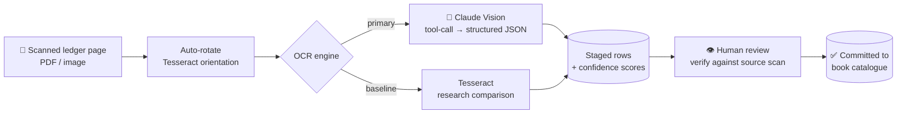
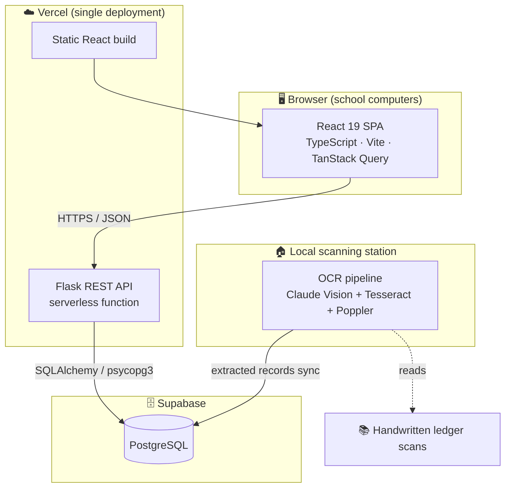

# 📚 ePustaka Munshi — Smart Library System with AI Ledger Digitization

> A full-stack library management system that replaces a Malaysian secondary school's **decades-old handwritten paper ledger** with a searchable digital catalogue — using a **vision LLM to read the handwriting** that traditional OCR couldn't.

<p>
  
  
  
  
  
  
</p>

**🔗 Live demo:** https://epustaka-munshi.vercel.app
**🎓 Final Year Project** — B.Sc. (Hons) Software Engineering, Universiti Teknologi Malaysia (UTM)
**🏫 Client:** SMK Abdullah Munshi (school library), in collaboration with the school librarian.

<!-- 📸 Add screenshots here (login · dashboard · OCR review · circulation) for the strongest first impression. -->

---

## 📖 Table of Contents

- [The Problem](#-the-problem-statement)
- [Objectives](#-project-objectives)
- [Scope](#-project-scope)
- [What It Does](#-what-it-does)
- [The AI/OCR Pipeline](#-the-aiocr-pipeline-the-novel-contribution)
- [System Architecture](#-system-architecture)
- [Tech Stack](#-tech-stack)
- [The Malaysian Ledger Format](#-the-malaysian-ledger-format)
- [Role-Based Access](#-role-based-access)
- [Engineering Highlights](#-engineering-highlights)
- [Run It Locally](#-run-it-locally)
- [Project Structure](#-project-structure)
- [Roadmap](#-roadmap--future-work)

---

## 🎯 The Problem Statement

For decades, SMK Abdullah Munshi's library recorded every acquired book by hand in a physical register — the *Daftar Buku-Buku Perpustakaan* ("library book ledger"). Borrowing and returning were tracked the same way: on paper.

This manual approach created real, compounding problems:

- **Records can't be searched.** Finding whether the library owns a title, or which copies exist, means flipping through handwritten pages.
- **History is locked away.** Years of acquisition data — titles, authors, prices, sources — sit in a ledger that no system can query, report on, or analyse.
- **Paper is fragile.** A single book is a single point of failure: fading ink, water damage, or a lost page erases the only copy of that record.
- **Cataloguing is slow and error-prone.** Manual transcription is laborious and inconsistent (the same class or name spelled different ways), making the records unreliable.
- **No operational visibility.** Staff can't easily see active loans, overdue books, or borrowing trends.

The hardest part of the digitization isn't building a database — it's that the ledger is filled with **decades-old cursive handwriting** that off-the-shelf OCR engines simply cannot read accurately.

> **In one line:** *How do you turn a fragile, unsearchable, handwritten library ledger into a reliable, centralized digital system that a school can actually use every day?*

---

## ✅ Project Objectives

1. **To analyze and design** a library management system that addresses issues in manual record-keeping, book cataloguing, and borrowing activities.
2. **To develop** a web-based library management system integrated with **OCR to digitize handwritten ledger records** into a centralized database, and to implement **barcode-based borrowing and returning** with **role-based access** for librarians and library prefects.
3. **To evaluate** the system's functionality, accuracy, and usability through testing and feedback from library staff and students.

## 🧭 Project Scope

- Modules for **book management, student records, borrowing & returning transactions, and OCR digitization**.
- Accessible through standard **web browsers**, deployed on **Vercel**, with **Supabase (PostgreSQL)** as the backend and **React** for the interface — usable on existing school computers with no installation.
- OCR is used specifically to **digitize the existing handwritten ledger records** into the catalogue.

---

## ✨ What It Does

| Module | Description |
|---|---|
| 📕 **Catalogue & Inventory** | Books with multiple physical copies — each tracked by accession number, barcode, status, condition, and shelf location. Barcode label printing built in. |
| 🔄 **Circulation** | Barcode checkout/return with two-step verification, 7-day loans with one renewal, date-based overdue tracking, and full loan history showing the staff handler. |
| 👥 **Members & Roles** | Borrowers (Student / Staff / External) and operators (Administrator / Librarian / Library Prefect). Students can be **promoted to Library Prefect** and demoted back, keeping their student portal. |
| 🤖 **Ledger OCR** | Upload a scanned ledger page → a vision LLM extracts structured fields with **per-row confidence scores** → staff verify each row against the source scan → commit to the catalogue. **Over 2,700 rows extracted from a 139-page ledger.** |
| 🏆 **NILAM Leaderboard** | Tracks the Malaysian *NILAM* reading programme — top students, classes, and forms by books read. |
| 📥 **Bulk Student Import** | Imports class rosters straight from the school's Excel files (one sheet per class) — parsed entirely in memory. |
| 🌐 **Bilingual UI** | Full English / Bahasa Melayu interface (i18next). |

---

## 🤖 The AI/OCR Pipeline (the novel contribution)

The academic and technical core of the project. Traditional OCR (**Tesseract**) was tested first and **could not reliably read the decades-old cursive handwriting**. The solution uses a **multimodal large language model — Anthropic's Claude Vision — as the primary OCR engine**, with Tesseract kept as a research baseline and for page-orientation detection.

Why a vision LLM wins here:

- It reads **cursive, smudged, rotated, and inconsistent handwriting** far better than classical OCR.
- Via **tool-calling**, the model returns **guaranteed-structured JSON** — each ledger column mapped to a typed field — instead of a blob of text that would need brittle regex parsing.
- It emits a **confidence score per row**, so low-confidence extractions are automatically flagged for human review.



**Human-in-the-loop by design:** the AI never writes to the catalogue directly. Extracted rows are *staged*; a librarian verifies each one against the original scan before committing — accuracy where it matters, speed where it doesn't.

**Compute/serving split:** OCR processing runs on a **local scanning station** (it needs the native imaging libraries and the API key), then the verified records **sync to Supabase**, which the Vercel web app serves to the whole school. Heavy compute stays local; the lightweight review-and-commit step works anywhere.

---

## 🏗️ System Architecture

A three-tier application deployed as a **single hybrid Vercel project** — one deployment serves both the React SPA and the Flask REST API.



- **Role-based access is enforced server-side** in the Flask API (permission flags), never trusted to the client.
- **Overdue status is computed by date** (`due_date < now`), not a stored flag — so it's always correct without a cron job.

---

## 🛠️ Tech Stack

| Layer | Technologies |
|---|---|
| **Frontend** | React 19, TypeScript, Vite 5, TanStack Query (React Query) 5, React Router 7, i18next, Bootstrap 5 |
| **Backend** | Flask 3, SQLAlchemy 2, Flask-Login, Flask-CORS |
| **Database** | Supabase (PostgreSQL) via psycopg 3; SQLite for local dev |
| **AI / OCR** | Anthropic Claude Vision (`claude-haiku-4-5`, configurable) · Tesseract + Poppler (baseline) |
| **Tooling** | python-barcode, openpyxl (Excel import), pdf2image |
| **Deployment** | Vercel (hybrid: static SPA + Python serverless function) |

---

## 🗂️ The Malaysian Ledger Format

The OCR maps each row of the physical *Daftar Bahan Bacaan* to a structured record, preserving the original Malaysian library schema:

| Field (BM) | Meaning |
|---|---|
| No. Perolehan | Accession / acquisition number |
| No. Panggilan | Call number |
| Pengarang | Author |
| Tajuk Buku | Book title |
| Penerbit | Publisher (place & name) |
| Tarikh Penerbit | Publication year |
| Tarikh Perolehan | Acquisition date |
| Bil. No. | Bill number |
| Punca | Source / origin |
| Harga | Price (RM) |
| Muka Surat | Page count |
| Catatan | Notes / remarks |

Committed rows are archived in a `digitized_ledger` table for full scan-to-book traceability, then linked to catalogue `Book` + `BookCopy` entries with standardized accession numbers and barcodes.

---

## 🔐 Role-Based Access

| Role | Capabilities |
|---|---|
| **Administrator** | Full access — users, catalogue, circulation, OCR digitization, settings. |
| **Librarian** | Catalogue, circulation, OCR digitization, member management. |
| **Library Prefect** | A promoted student: catalogue + circulation tools **plus** their normal student portal (search, my loans, NILAM leaderboard). |
| **Student** | Search the catalogue, view their own loans and overdue status, track NILAM reading progress. |

---

## 💡 Engineering Highlights

Decisions that show how the system handles real-world constraints:

- **Vision tool-calling for structured output** — the LLM returns typed JSON per ledger column via tool-calling, eliminating fragile text parsing and guaranteeing a consistent schema.
- **Resumable batch digitization** — a 139-page ledger is processed page-by-page with a per-page commit, so an interrupted run resumes exactly where it stopped instead of restarting (and re-paying for) the whole document.
- **Hybrid serverless deployment** — one Vercel project serves the static React SPA *and* the Flask API as a serverless function, sharing a single origin in production.
- **Read-only filesystem aware** — Vercel's serverless filesystem is read-only, so Excel imports are parsed **entirely in memory** (no temp files), while OCR source files persist only on the local station that needs them.
- **Performance** — eliminated N+1 query patterns that were the real source of list-page lag, and added pagination across heavy tables.
- **Data integrity** — server-side normalization (e.g. uppercase class names) prevents duplicate-by-casing records like `Inovatif` vs `INOVATIF`; blank fields are stored as `NULL` to avoid false uniqueness collisions.
- **Bilingual from the ground up** — every UI string is keyed through i18next (English / Bahasa Melayu).

---

## 🚀 Run It Locally

**Backend** (Python 3.10+):

```bash
pip install -r requirements.txt
python scripts/run_local_sqlite.py      # serves the API on a local SQLite DB (port 5000)
```

**Frontend** (Node 18+):

```bash
cd frontend
npm install
npm run dev                             # http://localhost:5173
```

**OCR digitization** (optional — needs an Anthropic API key and the OCR extras):

```bash
pip install -r requirements-ocr.txt     # pytesseract, pdf2image, anthropic
# also install the Tesseract and Poppler native binaries
# then set ANTHROPIC_API_KEY in a .env file
```

> OCR processing runs on a local station (it needs the native imaging libraries); the verified records sync to Supabase, which the deployed web app serves to everyone.

---

## 📁 Project Structure

```
app/
  models/      SQLAlchemy models (catalog, circulation, members, users, OCR)
  api/         REST API blueprints (auth, catalog, circulation, users, student, OCR)
  services/    OCR engines — vision_ocr_service (Claude), ocr_service (Tesseract)
  utils/       Excel import, barcode, serializers, text formatting
frontend/      React + TypeScript SPA (Vite)
scripts/       local runners + batch OCR CLI + maintenance scripts
api/           Vercel serverless entry point
config.py      environment-aware configuration
```

---

## 🔭 Roadmap / Future Work

- **Automated notifications** — email/push reminders for due-soon and overdue loans.
- **Cloud-hosted OCR** — a lightweight pipeline so digitization isn't tied to one local station.
- **Reporting & analytics** — borrowing trends, popular titles, overdue rates by class.
- **School registry integration** — auto-sync student records to remove the manual Excel import.

---

## 👤 Author

**Wan Zafirzan** — B.Sc. (Hons) Software Engineering, Universiti Teknologi Malaysia
GitHub: [@Zaphyrzan](https://github.com/Zaphyrzan) · Live demo: [epustaka-munshi.vercel.app](https://epustaka-munshi.vercel.app)

> Built as a Final Year Project to give a real Malaysian school library a system it can use every day — and to digitize a piece of its history that was at risk of being lost to time.
